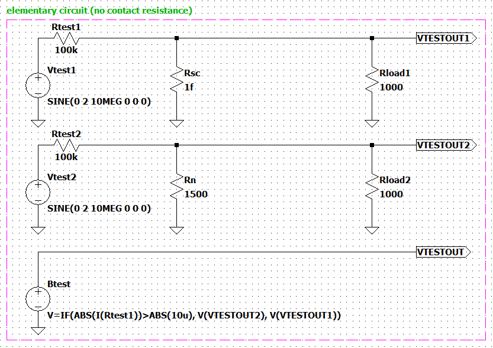
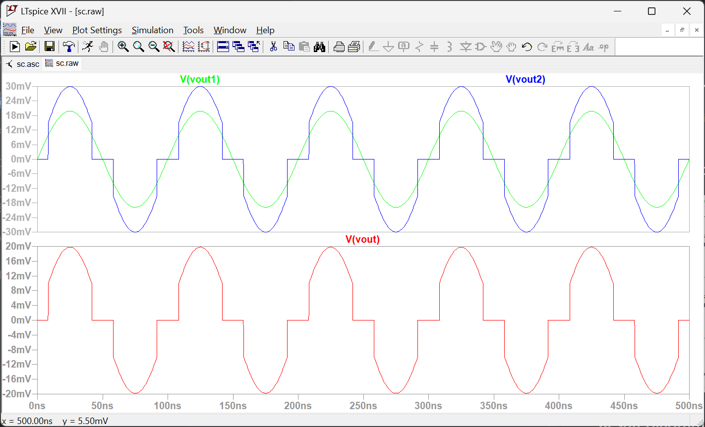

# Superconductor in LTspice
This repo shows a LTspice model of superconductor (only simple voltage pulse).

## Elementary circuit



## LTspice .lib file
To demonstrate the properties of an elementary circuit with a component, the `.lib` file is needed.
```
.subckt superconductor gate gatereturn n1 n2
+Ic=10u
+Rsc=1f
+Rn=1500
+Rct=10u

* superconducting property
R1 gate gatereturn 1f
B1 n1 n2 V=IF((abs(I(R1))<Ic), I(R1)*(Rsc+Rct), I(R1)*(Rn+Rct))

.ends superconductor
```

## Result diagram

